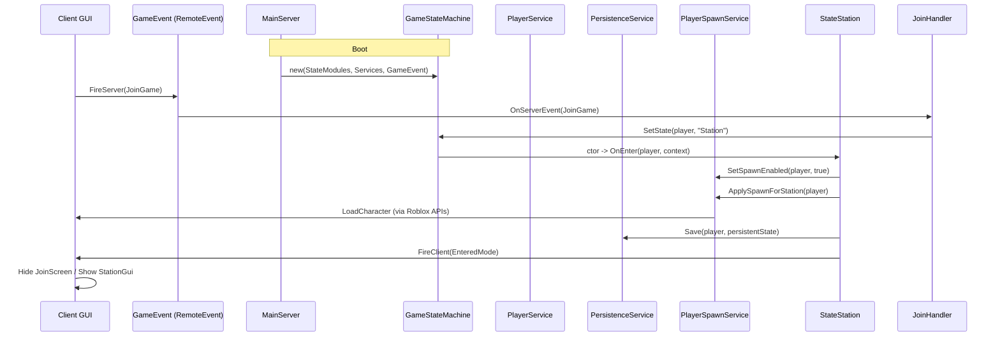
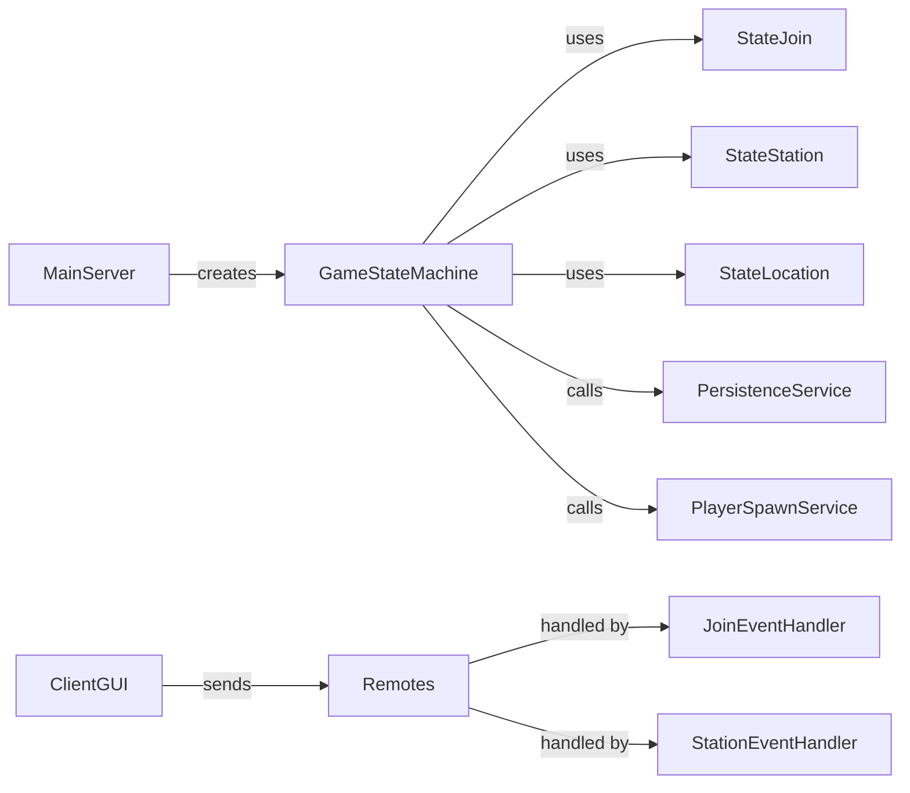

**MazerJack — Architecture Overview**

This short reference describes the main runtime components and their communication flows.

**Components**
- **Entry (server):** MainServer — initializes services and the `GameStateMachine` singleton.
- **FSM:** `GameStateMachine` — per-player state manager (locks transitions, single SetState API).
- **Services:** `PersistenceService`, `PlayerService`, `PlayerSpawnService`, `DoorService` — single-responsibility services.
- **Handlers / Remotes:** `JoinEventHandler`, `StationEventHandler`, `GameEvent`, `StationEvent` — client ↔ server contracts and delegators.
- **Client GUIs:** `JoinScreenClient`, `StationScreenClient` — driven by player attribute `CurrentMode`.

**Sequence (typical Join → Station flow)**

**Component diagram (high level)**

**Key files (examples)**
- `MainServer` — [ServerScriptService/MainServer.server.luau](ServerScriptService/MainServer.server.luau)
- `GameStateMachine` — [ServerScriptService/StateMachine/GameStateMachine.luau](ServerScriptService/StateMachine/GameStateMachine.luau)
- `StateStation` — [ServerScriptService/StateMachine/StateStation.luau](ServerScriptService/StateMachine/StateStation.luau)
- `PlayerService` — [ServerScriptService/Services/PlayerService.luau](ServerScriptService/Services/PlayerService.luau)
- `PersistenceService` — [ServerScriptService/Services/PersistenceService.luau](ServerScriptService/Services/PersistenceService.luau)
- `JoinScreenClient` — [StarterGui/JoinGameGui/JoinScreenClient.client.luau](StarterGui/JoinGameGui/JoinScreenClient.client.luau)
- `StationScreenClient` — [StarterGui/StationGui/StationScreenClient.client.luau](StarterGui/StationGui/StationScreenClient.client.luau)

**Notes & Recommendations**
- Validate remote payloads (types, required fields) in handlers to reduce malformed input.
- Replace `_G` singletons with a small service registry module for better testability.
- Add retry/backoff for `DataStore:SetAsync` or safe queued save to reduce data loss on transient errors.
- Add unit tests for `GameStateMachine` transitions and handler delegation.

---
Small, focused doc — ask if you want this added under `docs/` or expanded into UML/PNG assets.
