# Player Status Diagram (FSM + UI)

This document describes the per-player runtime states used by the server `GameStateMachine` and how the client UI is expected to react.

## State machine (authoritative)

```mermaid
stateDiagram-v2
    direction LR

    [*] --> Join: Players.PlayerAdded\nMainServer -> FSM:SetState("Join")

    Join: CurrentMode = "Join" (or nil during initial replication)
    Join: Spawn disabled\nPlayers.CharacterAutoLoads = false
    Join: JoinGameGui Enabled=true\nStationGui Enabled=false

    Join --> Station: Client clicks Join Game\nGameEvent:JoinGame\nJoinEventHandler -> FSM:SetState("Station")

    Station: CurrentMode = "Station"
    Station: Spawn enabled\nPlayerSpawnService:ApplySpawnForStation()\nStellarStation/Modules/CommandModule/SpawnLocation\nLoadCharacter()
    Station: JoinGameGui Enabled=false\nStationGui Enabled=true

    Station --> Join: ExitGame (Studio)\nStationEvent:ExitGame\nStateStation:RequestExitGame\nFSM:SetState("Join")

    Station --> Station: ExitGame (Live)\nTeleportService:Teleport(placeId)

    %% Reserved / future
    Station --> Location: GoLocation (reserved)\nStationEvent:GoLocation\nStateStation:GoLocation (stub)
    Location --> Station: Return to Station (future)

    Join --> [*]: PlayerRemoving
    Station --> [*]: PlayerRemoving
    Location --> [*]: PlayerRemoving
```

## UI rules (client-side)

- `JoinGameGui` is expected to be **disabled by default in assets** and enabled only when the player is not yet joined.
  - Condition: `CurrentMode == nil` or `CurrentMode == "Join"` → show Join menu.
  - Condition: any other mode (e.g., `"Station"`) → hide Join menu.
- `StationGui` is expected to be hidden unless `CurrentMode == "Station"`.

## Key signals / contracts

- Attribute: `Player:GetAttribute("CurrentMode")` is the single UI driver.
- RemoteEvents (canonical):
  - `ReplicatedStorage/GameEvent` (Join lifecycle)
  - `ReplicatedStorage/StationEvent` (Station actions)

## Related docs

- Architecture overview: [../ARCHITECTURE.md](../ARCHITECTURE.md)
- MVP requirements: [REQUIREMENTS_MVP_STATION.md](REQUIREMENTS_MVP_STATION.md)
