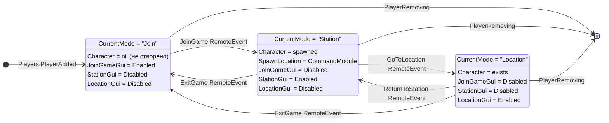

# Player Status Diagram (State Machine)

> Game Version: 2.1.0

Цей документ описує стани гравця та переходи між ними.

## State Machine (Authoritative)



## Стани

| State | CurrentMode | Character | Visible GUI |
|-------|-------------|-----------|-------------|
| Join | `"Join"` | `nil` | JoinGameGui |
| Station | `"Station"` | spawned | StationGui |
| Location | `"Location"` | exists | LocationGui |

## Переходи

| From | To | Trigger | RemoteEvent |
|------|-----|---------|-------------|
| — | Join | `PlayerAdded` | — |
| Join | Station | Click "ПРИЄДНАТИСЯ" | `JoinGame` |
| Station | Location | Click "НА ПЛАНЕТУ" | `GoToLocation` |
| Location | Station | Click "НА СТАНЦІЮ" | `ReturnToStation` |
| Station/Location | Join | Click "ВИХІД" | `ExitGame` |

## Player Attributes

| Attribute | Type | Set By | Description |
|-----------|------|--------|-------------|
| `CurrentMode` | `string` | Server | Поточний стан: `"Join"`, `"Station"`, `"Location"` |
| `IsNewPlayer` | `boolean` | Server | `true` якщо перший вхід в гру |

## GUI Visibility Rules

Клієнт (`GameClient.luau`) оновлює видимість GUI на основі `CurrentMode`:

```lua
local function updateGuiVisibility()
    local mode = player:GetAttribute("CurrentMode")
    
    if joinGameGui then
        joinGameGui.Enabled = (mode == "Join")
    end
    
    if stationGui then
        stationGui.Enabled = (mode == "Station")
    end
    
    if locationGui then
        locationGui.Enabled = (mode == "Location")
    end
end
```

## Contracts

- **Single source of truth**: `Player.CurrentMode` attribute
- **Server authority**: Only server changes `CurrentMode`
- **Client read-only**: Client only reads attributes, sends RemoteEvents
- **Transition cooldown**: 1 second between transitions (anti-spam)

## Related Files

- [GameServer.luau](../src/ServerScriptService/GameServer.luau) — state transitions
- [GameClient.luau](../src/StarterPlayer/StarterPlayerScripts/GameClient.luau) — GUI visibility
- [Constants.luau](../src/ReplicatedStorage/Shared/Constants.luau) — GameMode values
